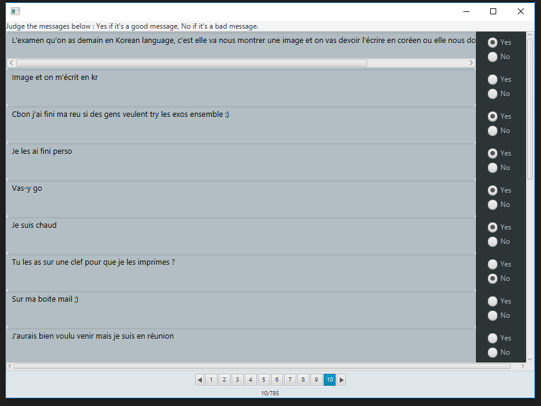

# SpamFilterBot
Discord bot to filter messages and display only relevant messages.  
The bot will read the Discord conversation, and according to its criterias, choose interesting messages to display in a special channel.

## Motivation
This project was created following the observation that it is difficult to follow a Discord conversation with many members without spending hours there.  
We decided to do something about it.  
The Discord bot, based on maching learning, will treat data that we give it, and learn.

## Platform
- [x] Windows
- [x] Linux
- [x] Mac

## Technology used
- Bot discord
  - [Discord](https://discordapp.com/)
  - Language : [Python](https://www.python.org/)
- Data Generator
  - Language : [Java 11](https://www.java.com)
  - GUI : [JavaFX 11.0.1](https://openjfx.io/)
  - Database : [MySQL 8.0.16](https://www.mysql.com/)
  - Compilation : [Gradle 5.4.1](https://gradle.org/)

## Features
- Discord Bot.
- Data Generation, used for trainning Discord Bot.

## Screenshots

  
  

## Installation
**Data Generator**
    1. Install MySQL
      - Download [MySQL](https://www.mysql.com/downloads/) and install/configurate it.
      - Create a user root with password root, or change it in /SpamFilterBot/DataGenerator/src/main/java/dataGenerator/dataStorage.java, line 26 (createDB method) and 46 (connectionDB method).
  2. Install [Java 11 or +](https://www.oracle.com/technetwork/java/javase/downloads/jdk11-downloads-5066655.html)
  3. Create Jar
      - **Windows**
        - Open search bar and search for Command Prompt.
        - Write and execute :
          ```
          cd /[YourLocalPath]/SpamFilterBot/DataGenerator/"
          ```
        - Write and execute :
          ```
          gradlew jar
          ```
        - Jar will be generated in "[YourLocalPath]/SpamFilterBot/DataGenerator/build/libs/" with name dataGenerator-[current version].jar.
      - **Mac / Linux**
        - Open a terminal.
        - Write and execute :
          ```
          cd /[YourLocalPath]/SpamFilterBot/DataGenerator/"
          ```
        - Write and execute :
          ```
          ./gradlew jar
          ```
        - Jar will be generated in "[YourLocalPath]/SpamFilterBot/DataGenerator/build/libs/" with name dataGenerator-[current version].jar.
  4. You can run it, **enjoy** !    

**Discord bot**


## How to use?
**Data Generator**
  1. Launch the Jar.
  2. Enter the name of MySQL database you want to use.
      - If database doesn't exist, software will create it later.
      - If database exists, software will connect to it and use it later.
      - If don't write a name, it will be "data" by default.
  3. Click on **Choose a file** button.
  4. Select a KakaoTalk file with txt extension. If you haven't a KakaoTalk File, you can export it from [KakaoTalk](https://cs.kakao.com/helps?articleId=1073183090&category=234&device=2&locale=en&service=8)
  5. Wait processing of parsing file, and generation/connection on MySQL database.
  6. The interface will change, now you can judge the interesting message by selecting yes or no for each message.
  7. You can change of page at the end of the interface by clicking on number page, or 	directional arrows.
  8. You can close the software, and run it later, all modifications will be save on database in live.    

**Discord bot**

## Why KakaoTalk file ?
We decided to use KakaoTalk file for generating data because it's the current platform we use for communication (so bigger data).  
Parsing class can be re-implemented with another support platform.

## Why Discord Bot ?
We decided to do a discord bot because Discord is popular, have a great documentation, in English (KakaoTalk documentation is in Korean for major parts).

## Contributors
[@Sugihiru](https://github.com/Sugihiru)  
[@VianneyDoleans](https://github.com/VianneyDoleans)  
[@Hardkaise](https://github.com/Hardkaise)  
Philippe  
Walter  
Alexis  
